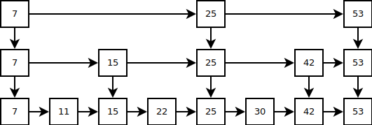
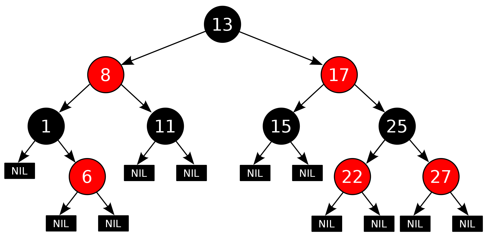

# Implement Key-value store

> Link project [kvstore](./kvstore)

## 1.1 Key Value Store

### a. Kiến thức về cấu trúc dữ liệu

* Database engine : Database engine (hay storage engine) là 1 thành phần phần mềm nằm bên dưới 1 hệ quản trị cơ sở dữ liệu (Database management system – DBMS), được dùng để tạo, đọc, cập nhật và xóa dữ liệu từ 1 cơ sở dữ liệu (CSDL). Đa số các DBMS cung cấp các API cho phép người dùng tương tác với những engine này mà không cần thông qua giao diện người dùng của DBMS.

* Data structure :  Một data structure (DS) là một cấu trúc lưu trữ dữ liệu theo định nghĩa của nó. Một DS hiệu quả cho phép thao tác với dữ liệu nhanh chóng, các hành động đó bao gồm thêm, sửa, xóa, cập nhật. Một số DS thì hiệu quả cho việc phục vụ DBMS nhưng một số khác thì không.

* Một số data structure sử dụng trong các Database Engine:
  * Skip List: Skip List là một cấu trúc cũng gần giống như Linked List nhưng cho phép tìm kiếm phần tử nhanh hơn và bù lại sẽ lưu trữ nhiều tầng Linked List sơ cấp ở bậc trên. Các node bậc trên sẽ có giá trị cách nhau một quãng dài hơn khoảng cách giữa các node bậc dưới. Ý tưởng khi tìm kiếm một node bất kì là thực hiện việc nhảy quãng ở các node bậc trên cho đến khi tìm được vị trí thích hợp bắt đầu đi xuống các node bậc dưới và lặp lại công việc cho đến khi tìm thấy node cần tìm.

  

  * Red-Black Tree: là một cây tìm kiếm nhị phân tự cân bằng, mỗi nút của cây đỏ-đen có một thuộc tính "màu" là một trong hai giá trị "đỏ" hoặc "đen", có tính chất "Mọi đường đi từ gốc đến cây con rỗng đều đi qua cùng một số nút đen như nhau" và "Nếu một nút có màu đỏ thì nút cha của nó phải tồn tại và có màu đen".

  

  * LSM Tree: 

* Yêu cầu:
  * Nắm rõ kiến thức về cấu trúc dữ liệu lưu trữ và lý do nó được sử dụng trong các Database Engine, phân biệt Data Structure và Database
  * Các DB Engine sử dụng nhiều Data Structure khác nhau, tùy vào từng khả năng của từng loại Database, nhiệm vụ của các bạn là tìm hiểu cơ bản các Data Structure hay được sử dụng và mục đích sử dụng của chúng.
* Gợi ý:
  * Một vài cấu trúc dữ liệu hay gặp như Slip List, Red-Black Tree, B-Tree, B+ Tree, LSM Tree,... trong đó cá Data Structure như LSM Tree, Skip List, B Tree được sử dụng trong các DB Engine như Postgres, Rocks DB hay một số DBMS khác.
  * Tham khảo [Data Structure](http://staff.ustc.edu.cn/~csli/graduate/algorithms/book6/toc.htm)
* Cách thực hiện:
  * Đọc và ghi chú những đặc điểm hay ho của từng Data Structure
  * Chọn một cấu trúc dữ liệu minh họa (lưu trữ dữ liệu dạng Key-value để phục vụ cho mục đích lưu trữ)
  * Cài đặt một cấu trúc dữ liệu nhằm mục đích lưu trữ dữ liệu dưới dạng key-value, cần nắm rõ về loại data structure sử dụng

### b. Kiến thức về Linux System

* Yêu cầu:
  * Ôn lại kiến thức cơ bản của Linux System như File System, I/O Blocking, Non-Blocking, Networking, Network Byte Order, Memory Management, Page Table, User/Kernel Space, Semaphore, Mutex,...
  * Tìm hiểu các kiến thức nâng cao về:
  * IPC: Signal, Shared Memory, Pipes,...
  * Tìm hiểu nhóm các API trong POSIX, POSIX Message Queue,...
  * Nắm rõ các System call để làm việc với hệ thống.
* Tham khảo:
  * Blocking vs Non-Blocking I/O
  * IPC
  * Sách về Linux System Programming
  * POSIX
* Kết quả cần đạt được:
  * Nắm vững kiến thức về Linux System.
  * Ghi chú đầy đủ, tốt nhất nên có code demo chạy được.

### c. Kiến thức về kỹ thuật lập trình

* Ôn lại kiến thực về Pointer, Function Pointer, OOP (nếu dùng C++ làm ngôn ngữ thể hiện)
* Xử lý chuỗi

### d. Công cụ hỗ trợ

* Do làm việc với bộ nhớ nên những debuger của IDE sẽ không giúp ích được nhiều do đó nên tìm hiểu và sử dụng GDB (GNU debuger), sau này có thể sử dụng nó cho Golang.
* Valgrind công cụ để check Memory Leak
* Cmake để hỗ trợ tạo makefile

## 1.2 Key Value Store service

* Yêu cầu:
  * Sau khi hòan thành `1.1` hãy xây dựng cho mình một Key-Value Store Service tương tự như RocksDB.
  * Sử dụng cấu trúc dữ liệu đã implement ở `a` và kiến thức ở `b,c,d` để thực hiện.

* Kết quả cần đạt được:
  * Server đáp ứng cùng một lúc nhiều client tham gia.
  * Dữ liệu được ghi xuống đĩa an toàn và hiệu quả
  * Client cần phải được xây dựng rõ ràng, xây dựng các test case.

## 3. Ngoài lề

* Khuyến khích sử dụng C tuần hoặc C++, tránh viết lẫn lộn giữa C và C++.
* Xây dựng Project Structure rõ ràng, để người đọc code dễ hình dung hơn.
* Nên tìm hiểu và sử dụng những kĩ thuật để tối ưu hóa cho service

> Tham khảo
https://medium.com/databasss