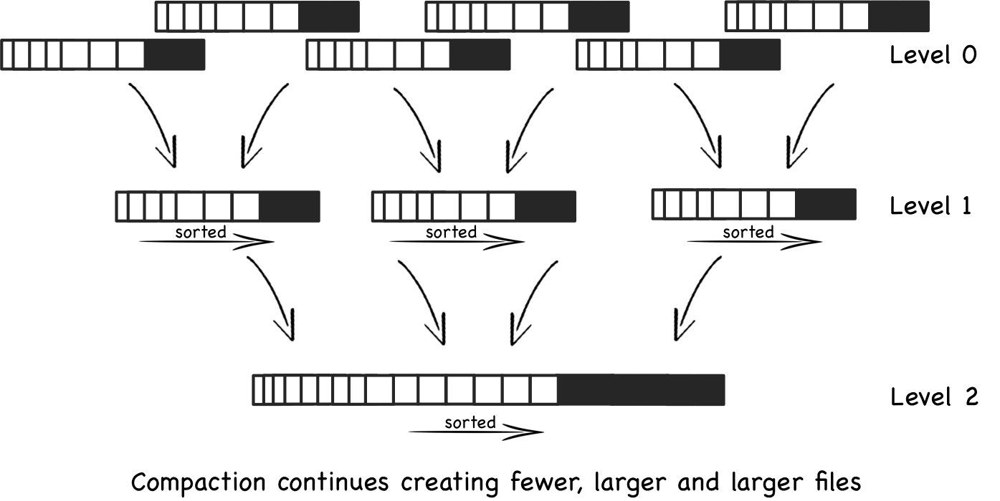

# Key-value Store Implementation

> Link project [kvstore](./kvstore)

## 1.1 Key Value Store

### a. Kiến thức về cấu trúc dữ liệu

* Database engine : Database engine (hay storage engine) là 1 thành phần phần mềm nằm bên dưới 1 hệ quản trị cơ sở dữ liệu (Database management system – DBMS), được dùng để tạo, đọc, cập nhật và xóa dữ liệu từ 1 cơ sở dữ liệu (CSDL). Đa số các DBMS cung cấp các API cho phép người dùng tương tác với những engine này mà không cần thông qua giao diện người dùng của DBMS.

* Data structure : Là một cách để lưu trữ và tổ chức dữ liệu để thực hiện các thao tác tìm kiếm, thêm, xóa hiệu quả. Một số datastructure như Linked List, Stack, Queue, Graph.

* Một số data structure sử dụng trong các Database Engine:
  * Skip List: Skip List là một cấu trúc cũng gần giống như Linked List nhưng cho phép tìm kiếm phần tử nhanh hơn và bù lại sẽ lưu trữ nhiều tầng Linked List sơ cấp ở bậc trên. Các node bậc trên sẽ có giá trị cách nhau một quãng dài hơn khoảng cách giữa các node bậc dưới. Ý tưởng khi tìm kiếm một node bất kì là thực hiện việc nhảy quãng ở các node bậc trên cho đến khi tìm được vị trí thích hợp bắt đầu đi xuống các node bậc dưới và lặp lại công việc cho đến khi tìm thấy node cần tìm.

  

  * Red-Black Tree: là một cây tìm kiếm nhị phân tự cân bằng, mỗi nút của cây đỏ-đen có một thuộc tính "màu" là một trong hai giá trị "đỏ" hoặc "đen", có tính chất "Mọi đường đi từ gốc đến cây con rỗng đều đi qua cùng một số nút đen như nhau" và "Nếu một nút có màu đỏ thì nút cha của nó phải tồn tại và có màu đen".

  

  * LSM Tree: LSM Tree có một số tương tự như BTree, với một số điểm khác biệt là nó tối ưu cho việc truy cập đĩa, và mỗi node có thể chứa full. LSM Trees cho phép dữ liệu bền vững, tổ chức các node thành 2 level, dùng kĩ thuật sắp xếp ngoại ở mỗi node.

  

  
  * BTree: Là một cây tìm kiếm nhiều nhánh, tự cân bằng, BTree thích hợp cho hệ thống lưu trữ mỗi lần truy xuất một block data. Nó thường được sử dụng trong database hoặc hệ thống file. 
  
  > https://en.wikipedia.org/wiki/B-tree

* Ở bài tập này, em chọn BTree để thực hiện key-value store, theo đó mỗi node sẽ lưu trữ vị trí offset của nó, và vị trí offset của các node con của nó trên file, kích thước của mỗi node được điều chỉnh sao cho bằng với kích thước 1 block size (~ 4096 bytes).

### b. Kiến thức về Linux System

* File System : https://en.wikipedia.org/wiki/File_system

* I/O Blocking vs Non-blocking:

    

- **Blocking I/O**:
  - Khi một client tạo một request để connect tới server, một thread được tạo ra để handle connection đó bị blocked cho đến khi có dữ liệu để đọc, hoặc data được ghi đầy đủ.
  - Cho đến khi những hàm được thực thi tác vụ ghi/đọc hoàn thành thì thread không thể làm gì ngoài việc đợi.
  - Để đáp ứng những request đồng thời với hướng tiếp cận đó, chúng ta phải cần nhiều thread, nói cách khác chúng ta phải tạo một thread mới cho mỗi connection từ client.
  - Mỗi thread yêu cầu một không gian vùng nhớ trên stack để lưu trữ tài nguyên và số lượng connection tăng lên làm cho vùng nhớ ngày càng cạn kiệt.
  - Tại mỗi thời điểm có thể có nhiều thread cùng chờ đợi client hoàn thành xong tác vụ I/O, làm lãng phí tài nguyên.

- **Non-blocking I/O**:
  - Cho phép chỉ một thread được đọc data từ kênh, và chỉ được lấy những thứ đang có sẵn, hoặc không lấy được gì nếu không có dữ liệu có sẵn. Khác với việc thread bị block cho đến khi dữ liệu được có sẵn cho việc đọc, một thread có thể tự do làm việc khác.
  - Một điều tương tự đúng cho non-blocking writing. Một thread có thể gửi yêu cầu để ghi một số data tới channel, nhưng không phải đợi đến khi được ghi hoàn toàn.
  - Những thread sẽ không tiêu tốn thời gian cho việc chạy không (idle) mà chuyển sang channel khác để handle trong những khoảng thời gian đó.
  - Khi đó một thread có thể quản lý nhiều channel cho việc nhập xuất cùng một lúc.

* Networking [note here](./network.md)

* Network Byte Order: Kiến trúc máy tính khi biểu diễn giá trị lớn hơn một bytes (ví dụ số int), sẽ quy định cách sắp xếp các bytes đó được biết đến với "big-endian" và "litle-endian". Ví dụ khi biểu diễn số 1 (integer), theo kiểu "big-endian" thì các bytes sẽ lần lượt có giá trị là 0,0,0,1 còn theo "litle-endian" thì ngược lại là 1,0,0,0.
* Network Byte Order là quy định thứ tự các byte được gửi và nhận từ host tới network và từ network tới host, vì trên từng môi trường là thứ tự này sẽ khác biệt.

* Memory Management: https://linuxaria.com/howto/linux-memory-management

* Page table: https://en.wikipedia.org/wiki/Page_table

* User space: http://www.linfo.org/user_space.html
* Kernel space: http://www.linfo.org/kernel_space.html
* Semaphore, mutex: https://en.wikipedia.org/wiki/Semaphore_(programming)
* IPC https://www.geeksforgeeks.org/inter-process-communication/
* Message queue https://www.cloudamqp.com/blog/2014-12-03-what-is-message-queuing.html

* Blocking- nonblocking queue: https://codereview.stackexchange.com/questions/143070/blocking-and-non-blocking-queue

### c. Kiến thức về kỹ thuật lập trình

* Ôn lại kiến thực về Pointer, Function Pointer, OOP (nếu dùng C++ làm ngôn ngữ thể hiện)
* Xử lý chuỗi

### d. Công cụ hỗ trợ

* Do làm việc với bộ nhớ nên những debuger của IDE sẽ không giúp ích được nhiều do đó nên tìm hiểu và sử dụng GDB (GNU debuger), sau này có thể sử dụng nó cho Golang.
* Valgrind công cụ để check Memory Leak
* Cmake để hỗ trợ tạo makefile

## 1.2 Key Value Store service

* Yêu cầu:
  * Sau khi hòan thành `1.1` hãy xây dựng cho mình một Key-Value Store Service tương tự như RocksDB.
  * Sử dụng cấu trúc dữ liệu đã implement ở `a` và kiến thức ở `b,c,d` để thực hiện.

* Kết quả cần đạt được:
  * Server đáp ứng cùng một lúc nhiều client tham gia.
  * Dữ liệu được ghi xuống đĩa an toàn và hiệu quả
  * Client cần phải được xây dựng rõ ràng, xây dựng các test case.

## 3. Ngoài lề

* Khuyến khích sử dụng C tuần hoặc C++, tránh viết lẫn lộn giữa C và C++.
* Xây dựng Project Structure rõ ràng, để người đọc code dễ hình dung hơn.
* Nên tìm hiểu và sử dụng những kĩ thuật để tối ưu hóa cho service

> Tham khảo
https://medium.com/databasss